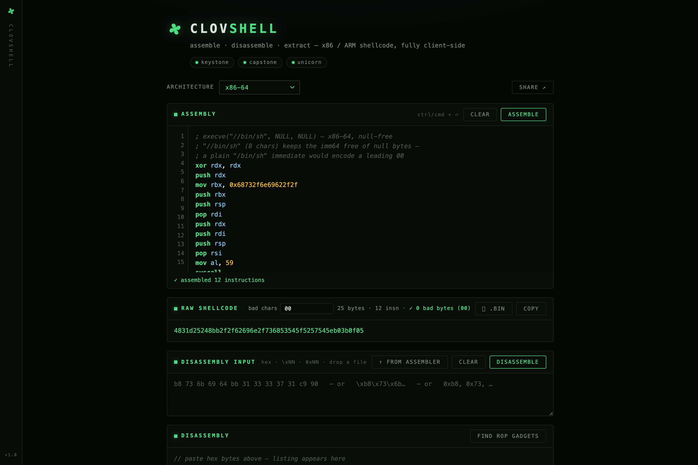

<div align="center">


# clovshell

**A shellcode workbench in your browser.** Assemble, disassemble, emulate, inspect, and export x86 and ARM shellcode.

[Live demo](https://atulhacks.github.io/clovshell/) · [Run locally](#run-locally)

[](https://github.com/atulhacks/clovshell/actions/workflows/ci.yml)
[](LICENSE)



</div>

clovshell runs [Keystone](https://www.keystone-engine.org/), [Capstone](https://www.capstone-engine.org/),
and [Unicorn](https://www.unicorn-engine.org/) as WebAssembly. Assembly and emulation happen locally;
your source and shellcode are not sent to a backend.

| Target | Mode | Emulated syscall entry |
| --- | --- | --- |
| x86-64 | 64-bit | `syscall` |
| x86-32 | 32-bit | `int 0x80` |
| ARM | A32 | `svc` |
| ARM | Thumb / Thumb-2 | `svc` |
| ARM64 | AArch64 | `svc` |

## Run locally

```sh
npm install
npm run dev
```

Open the URL printed by Vite (normally `http://localhost:5173`). `npm install` copies the Keystone
and Capstone WASM files into `public/wasm/` through `postinstall`.

## What you can do

### Assemble and inspect

- Write x86-64, x86-32, ARM A32, ARM Thumb, or ARM64 assembly and see the emitted bytes and instruction listing.
- Paste hex as contiguous bytes, spaced bytes, `\xNN`, or `0xNN`; drop a raw `.bin` file into the page.
  Assembly files (`.asm`/`.s`) can be dropped into the editor.
- Highlight bad bytes such as `00 0a 0d`, count null bytes, and download the result as `.bin`.
- Use labels, common data-emitting directives, and an approximate source-line hint for assembly errors.

### Emulate and trace

- Run shellcode in Unicorn's mapped code and stack memory. Syscalls are intercepted, not issued by
  the host; the UI shows calls, arguments, return values, faults, and final registers.
- Step through the first **400 executed instructions**, including the bytes fetched from emulated
  memory (useful for self-modifying code) and registers captured before each instruction. Navigate
  with buttons or arrow keys, or save the trace as JSON.
- Follow A32↔Thumb `bx`/`blx` interworking. Each fetched instruction and stage records its actual
  execution mode so mixed-mode traces and stage disassembly stay accurate; the ARM register view
  includes `cpsr`. Mixed-mode input can be loaded as raw bytes.
- Explore an observed **execution-flow graph** across the full run, not just the first 400 trace
  steps. It aggregates instruction and edge hit counts, identifies branches, back edges, ISA-mode
  switches and stage hops, and links the first traversal back to the trace or captured stage.
  Filter transfers or inspect every edge; the complete bounded graph is included in JSON export.
  Nodes are distinct by address, instruction bytes, mode and stage, so re-executed rewritten code
  is not conflated with its earlier version. Capture is capped at 4,096 nodes and 8,192 edges.
- Inspect the **Code Mutation Atlas** for writes to the loaded code image: original bytes, pre/post
  write bytes, the writing instruction, and the first observed execution of changed bytes. Download
  the final code-image snapshot as `.bin` or the trace and mutation evidence as JSON. Image mutations
  are bounded to 2,048 changed spans.
- Follow the **Stage Graph** when code is written to a new `mmap` allocation, the stack, or the original
  image. It links the writing stage to the first execution of changed bytes, records `mmap`/`mprotect`
  transitions, and preserves a 4 KiB snapshot at first execution—even beyond the 400-step trace cap
  or when those bytes are overwritten later. Download individual stage snapshots or the full JSON
  evidence. Capture is bounded to 64 stage snapshots, 64 pending dirty pages, and 256 observed bytes
  per individual write; a limited capture is labeled in the result.
- Use the **Stage Explorer** to compare each executed page with its before-write snapshot, inspect
  changed byte spans and side-by-side disassembly, and inspect bounded writer/execution windows with
  per-step registers (six instructions on either side of a transition). These windows retain evidence
  beyond the main 400-step trace; the JSON export includes
  the snapshots, diff counts, and transition context. Fresh mappings and the initial stack/code
  slack are explicitly zeroed so successive emulation runs cannot inherit stale WASM memory.
- Set an initial first-argument register (`rdi`, `r0`, or `x0`) for function-style shellcode.
- Keep the UI responsive with worker-based emulation, a 30-second outer timeout, and a
  100,000-instruction limit.

### Transform and extract

- Generate self-decoding XOR wrappers for all five targets. Auto-pick a key that avoids configured
  bad bytes in the **complete stub and payload**, then load the result into the editor and run it.
- Find short ROP gadgets by scanning each byte offset, with a 400-result cap and text filtering.
- Export Python, C, C#, Java, JavaScript, Rust, Ruby, PowerShell, NASM, Base64, escaped strings,
  and YARA snippets. Each format has copy and download controls.

### Work faster

- Browse per-architecture Linux syscall numbers and insert an assembly scaffold at the cursor.
- Load tested `execve` and exit presets with one click. Share source and architecture through a
  URL fragment; the editor also restores local state.
- Choose among five themes. The layout works at phone widths and respects reduced-motion settings.
- Install the production build as a PWA. Once its assets have been precached, it works offline,
  including the lazy-loaded emulator engines.

[Emulation screenshot](docs/shot-emulation.png) · [XOR encoder screenshot](docs/shot-encoder.png)

## Scope and limits

clovshell is a CPU-and-syscall workbench, **not a full Linux VM**. File and socket operations are
simulated; unmodeled syscalls return `-ENOSYS`. A source file is assembled in the selected entry
mode; for A32/Thumb mixed-mode programs, import an already assembled binary or paste its bytes.

The emulator stops on unmapped memory faults. Returning shellcode lands on a sentinel instead of
continuing into unrelated memory. Its instruction trace is capped at 400 entries even when the
program executes longer. Gadget searches are likewise bounded to keep large inputs responsive.

## Build, test, and deploy

```sh
npm run check    # TypeScript typecheck
npm test         # Vitest, including real WASM engines and cross-architecture emulation
npm run build    # production site in dist/
npm run preview  # serve the production build locally
```

`dist/` is static and uses relative asset paths, so it can be served from a domain root or a
subpath. The build generates a content-derived service-worker cache name and precaches the app,
WASM files, and lazy worker/engine chunks. Use `npm run build && npm run preview` to test offline
behavior; the service worker does not register in Vite's development mode.

GitHub Actions runs typecheck, tests, and build for pushes and pull requests. The Pages workflow
publishes `main` to the [live demo](https://atulhacks.github.io/clovshell/). For another static
host, publish the contents of `dist/`.

## Assembly notes

- Write one instruction per line. `;`, `#`, `//`, and ARM `@` comments are stripped before assembly;
  Keystone's semicolon statement separator is therefore unavailable.
- Labels resolve through Keystone. GNU numeric local labels (`1:` / `1b`) are not supported.
- Non-emitting directives such as `.global`, `.type`, `.section`, and `.cfi_*` are ignored.
  Data-emitting directives such as `.byte`, `.word`, `.quad`, `.ascii`, and `.asciz` are retained.
  Unrecognized dot-directives are dropped; use `.short` in place of `.hword`.
- Error-line hints are approximate for forward references. The x86 parser uses Intel-style
  operands (`mov eax, 1`). On ARM, prefer `movw`/`movt` over Keystone's unreliable
  `ldr rX, =imm` literal-pool placement.

## Project map

| Path | Purpose |
| --- | --- |
| `src/engines.ts`, `src/directives.ts` | WASM assembly/disassembly and source preprocessing |
| `src/emu.ts`, `src/emu-worker.ts`, `src/stage-explorer.ts` | Emulation, execution capture, and stage comparison |
| `src/encoder.ts`, `src/gadgets.ts`, `src/gadget-worker.ts` | XOR wrappers and bounded gadget scans |
| `src/syscalls*.ts`, `src/presets.ts` | Syscall reference, scaffolds, and examples |
| `src/main.ts`, `src/editor.ts`, `src/ui.ts` | Workbench interface and state |
| `src/tests/` | Engine and UI-logic regression tests |
| `scripts/` | WASM copy, syscall-table generation, service-worker finalization |
| `public/sw.js` | Production offline cache |

The syscall data can be regenerated with `node scripts/gen-syscalls.mjs` using an authenticated
`gh` CLI. The script caches the kernel sources under `scripts/kernel-src/`.

## License

clovshell is [GPL-2.0](LICENSE). Keystone and Unicorn are GPL-2.0; Capstone is BSD-3-Clause.
